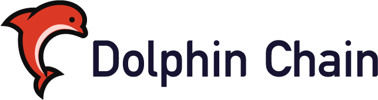
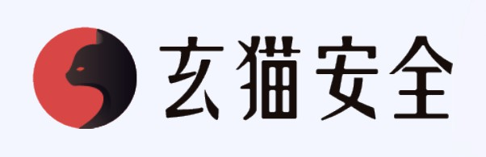
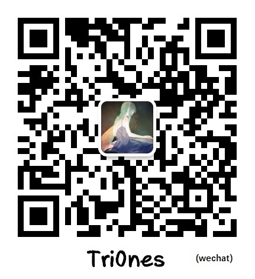

# DolphinChain

DolphinChain is the first Vulnerable Blockchain Application in the world! [dolphinchain.org](http://dolphinchain.org)

Version : 1.0.0

[中文说明](./README.zh-cn.md)

## Table of Contents

<!-- TOC -->

- [DolphinChain](#dolphinchain)
  - [Table of Contents](#table-of-contents)
  - [Overview](#overview)
  - [Installation](#installation)
  - [Usage](#usage)
  - [Tendermint Bugs History](#tendermint-bugs-history)
  - [Contribution](#contribution)
  - [Backer](#backer)
  - [Connection](#connection)
  - [TODO](#todo)
  - [License](#license)

<!-- /TOC -->

## Overview

DolphinChain is a deliberately insecure blockchain application maintained by [XuanMao Secure Lab](https://github.com/XuanMaoSecLab) designed to teach blockchain application security lessons. You can install and practice with DolphinChain.

`DolphinChain` was developed based on `tendermint v0.31.2 (WARNING: ALPHA SOFTWARE)`, which is the latest version of `tendermint` at that time.

In this release (v1.0.0), there are about 10 bugs in DolphinChain. Any whilehat and developer of blockhain can try to exploit the vulnerabilities. It's main goals are to be an aid for security professionals improving skills and help blockchain developers better understand the processes of securing blockchain applications.

## Installation

1. Download and install [golang](https://golang.org/doc/install)

2. Download and install DolphinChain.

3. Get all dependencies of DolphinChain.

All you need is ready !

You can look for [Installation](./doc/Installation.md) for more details.

## Usage

Deploy `DolphinChain` -> Find defect code -> Write verification script -> Verify vulnerability exists

1. Finding Vulnerabilities: Blockchain vulnerabilities are mainly caused by code issues and logic problems.
2. Write a verification script: There are two ways to test a script with PoC or Go test.

Of course we will expose all the `Writeup`. You can view it through our another Repository.

At the same time, we also summarized the historical vulnerability of `tendermint`, see [Tendermint Bugs History](#Tendermint-Bugs-History)

## Tendermint Bugs History

Tendermint is a core component of the Cosmos network ecosystem and is primarily responsible for consensus and P2P. Since its development in 2014, the community has been active, code iterations are fast, and most importantly, security is highly valued. Therefore, by learning the security vulnerabilities and fixes of this chain, we can let other developers learn their ideas and avoid stepping on the pits that the predecessors have already stepped on.

Here is the bugs history of tendermint we collected. We spent almost a month finishing.

|   |  P2P  |  consensus  |  node  |  RPC  |  marshal  |  message queue  |  database  |  message  |  logic  |  seed list  |  mempool  |
|----|----|----|----|----|----|----|----|----|----|----|----|
null pointer  |  X  |  X  |  X  |    |  X  |    |  X  |  X  |  X  |  X  |  X  |
null config  |    |  X  |  X  |    |  X  |    |  X  |  X  |  X  |  X  |  X  |
lack of err handle  |  X  |  X  |  X  |  X  |  X  |  X  |  X  |  X  |  X  |    |  X  |
server hang on  |    |    |    |    |    |    |    |    |    |    |  X  |
Concurrent quantity limit  |  X  |    |  X  |  X  |  X  |    |    |  X  |    |    |  X  |
Abnormal value  |  X  |  X  |    |  X  |  X  |    |  X  |  X  |    |  X  |    |
component logic  |  X  |  X  |    |    |    |  X  |    |    |  X  |    |    |
overflow  |    |    |    |    |  X  |  X  |    |    |    |    |    |
lock  |  X  |    |  X  |    |    |    |    |    |    |    |    |
DOS  |  X  |    |    |    |    |    |  X  |    |    |  X  |  X  |
memory leak  |  X  |    |    |  X  |    |    |    |  X  |    |    |    |
initing  |  X  |  X  |  X  |    |    |  X  |  X  |    |  X  |    |  X  |
dependencies  |    |    |  X  |    |    |    |    |  X  |    |    |    |
resource control  |  X  |    |  X  |    |    |  X  |    |  X  |    |    |  X  |

## Contribution

Welcome to submit any question via issue. Moreover, you can also develop more vulnerabilities with us.

Contributors ：

Tri0nes、Javierlev

## Backer

  
   
   
  
    
  

## Connection

## TODO

- [ ] There may be some bugs and we are fixing.
- [ ] Write `Writeup` for vulnerabilities existed
- [ ] Sort out new vulnerabilities as follow-up development
- [ ] Some particularly interesting ideas

## License

DolphinChain is licensed under the MIT License. See [LICENSE](./LICENSE) for the full license text.
